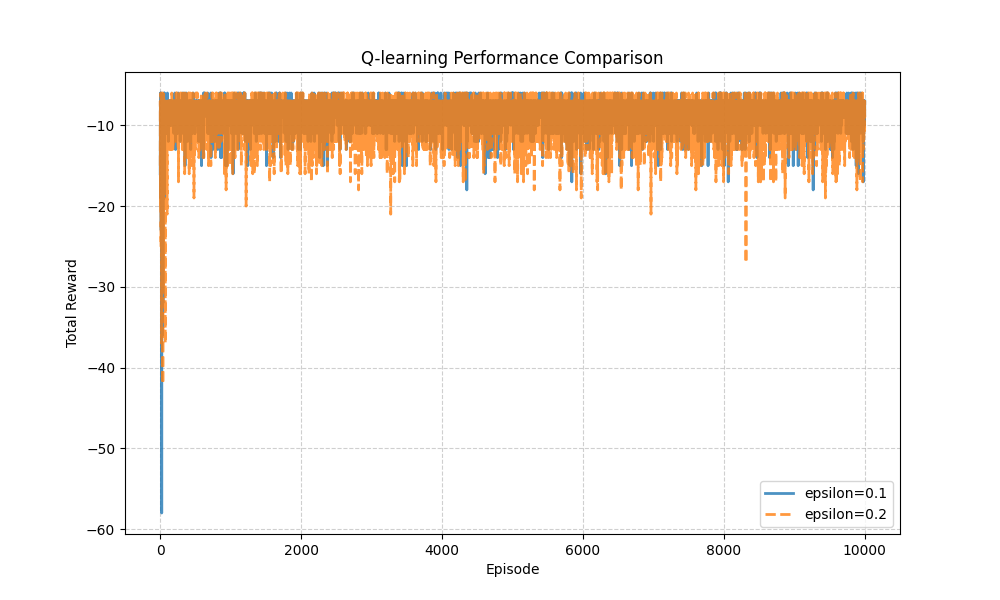

# Q-learning-grid-world
Q-learning algorithm on a 5*5 grid world,with parameter comparison experiments.
# Q-learning on 5x5 Grid World

This project implements Q-learning algorithm on a 5x5 grid world (FrozenLake style). The agent learns to navigate from start (0,0) to goal (4,4) while avoiding holes.

## Environment

- Grid size: 5x5
- Start: (0,0), Goal: (4,4)
- Holes: [(1,0), (3,1), (4,2), (1,3)]
- Reward: -1 per step, -5 for hole, +1 for goal

## Parameter Comparison

I compared the effect of different epsilon (exploration rate) on training performance.

- epsilon = 0.1
- epsilon = 0.2

### Results

The following figure shows the learning curves (smoothed over 100 episodes):

As epsilon increases, the agent explores more and achieves slightly higher final reward.

## How to Run

1. Install dependencies: `pip install numpy matplotlib`
2. Run the training: `python Q-Learning\ Algorithm.py`
3. Generate comparison plot: `python plot_compare.py`

## Files

- `Q-Learning Algorithm.py`: Main training script
- `plot_compare.py`: Script to generate comparison plot
- `rewards_eps0.1.csv`, `rewards_eps0.2.csv`: Training logs
